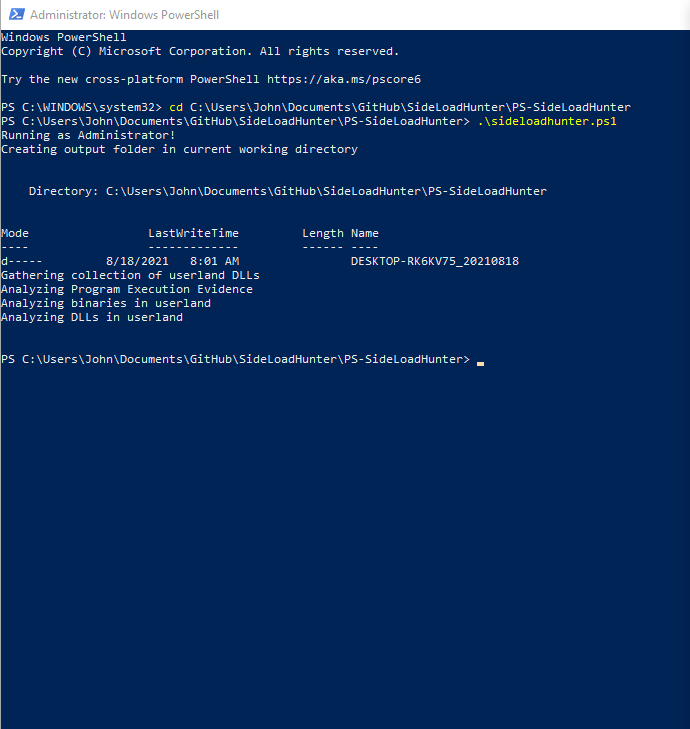
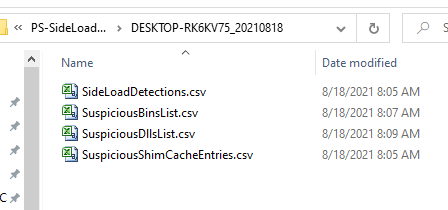

SideLoadHunter-PS is a PowerShell script which will profile the endpoint for
DLLs and executables within user’s profiles, System32, and SysWow64. Once the
executables and DLLs have been profiled, comparative analysis is performed to
identify possible evidence of DLL sideloading through file names, hash values,
and internal names. Additionally, program execution artifacts data are parsed
and analyzed for evidence of sideloaded executables that no longer exist on
disk.

The main functions of SideLoadHunter are:

-   Get-SideLoadDetect

-   Get-SusShimcache

-   Get-SusExecs

-   Get-SusDlls

Get-SideLoadDetect – Comparative analysis function designed to identify
situations where a System32/SysWow64 executable is located in a userland
directory along with a DLL that matches a System32/SysWow64 DLL name but is not
signed by Microsoft.

Get-SusShimcache – To provide some detection capabilities for sideloaded
executables that are no longer on disk, SusShimcache will analyze ShimCache
entries for System32 and SysWow64 executables have executed from a non-standard
location.

Get-SusExec & Get-SusDLLs – Profiles a system to locate System32 and SysWow64
executables and DLL files that do not exist within their default location.

Upon completion of the analysis, the results will be exported into CSV files to
a folder named with the hostname value and current date.

To run simply execute the sideloadhunter.ps1 file via PowerShell as an
administrator.

